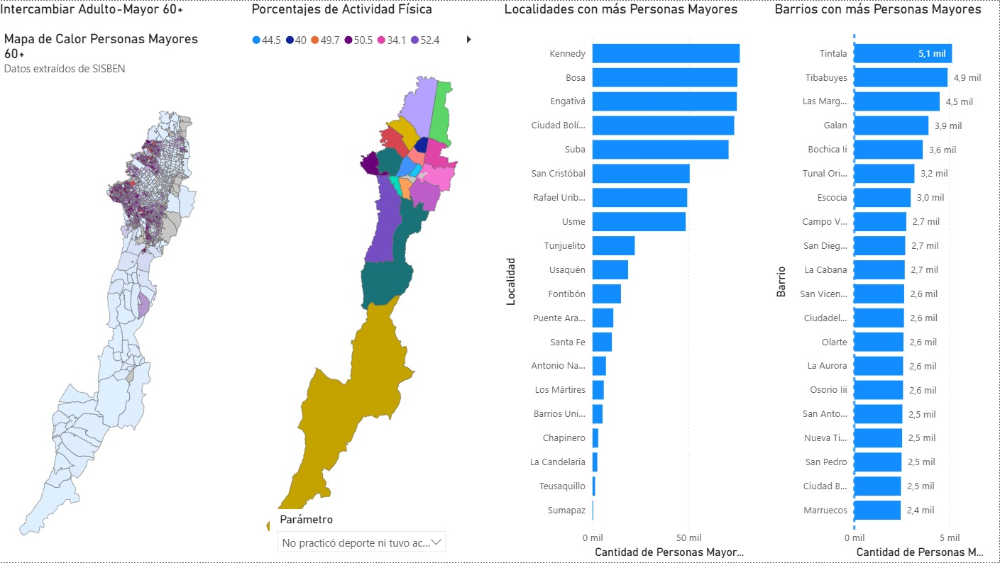
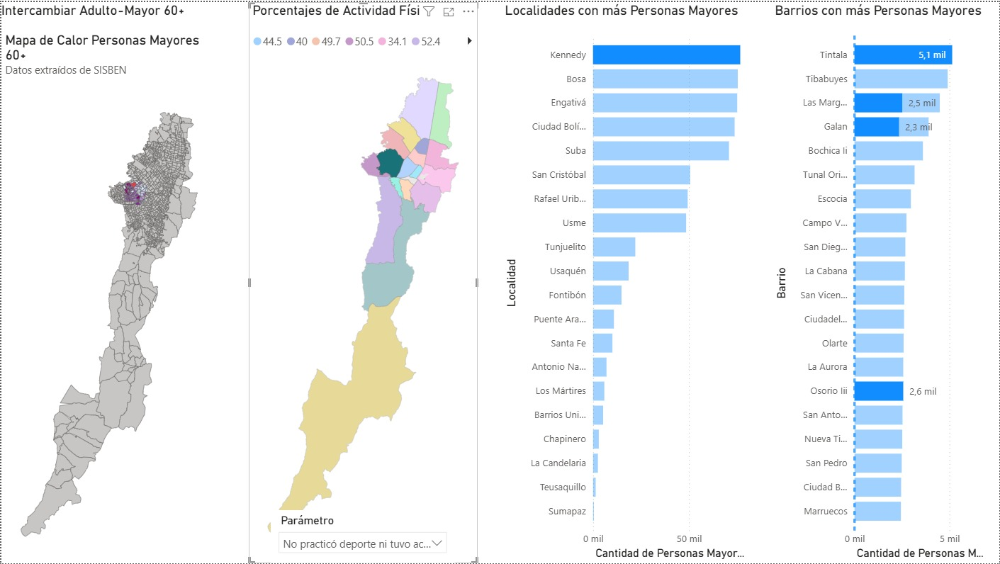
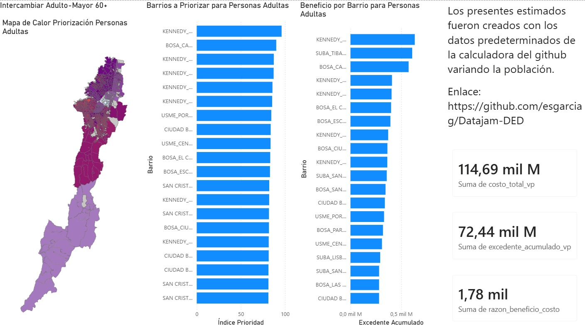
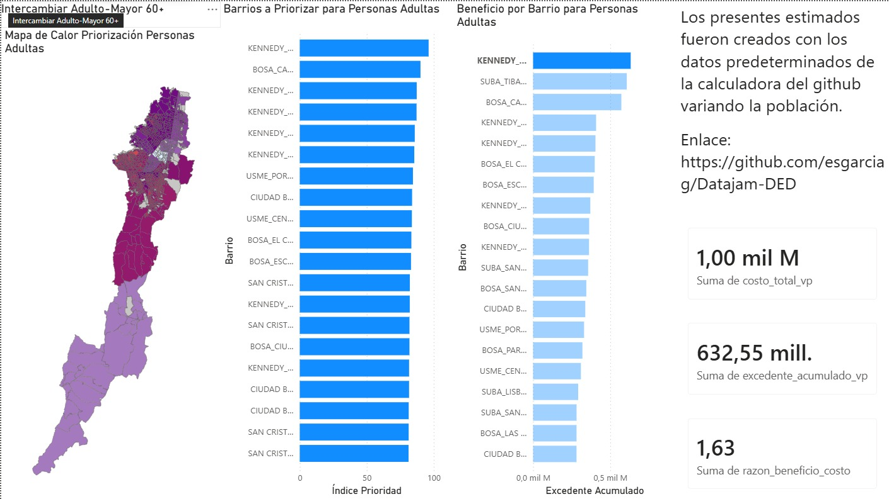
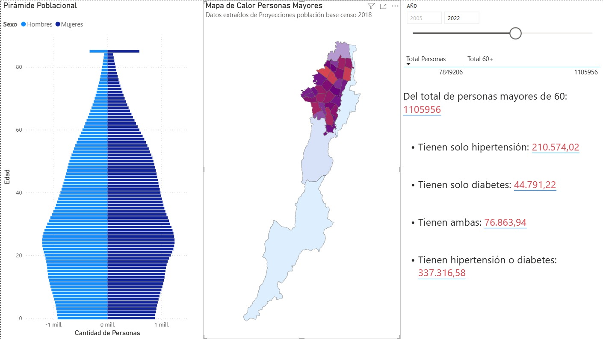
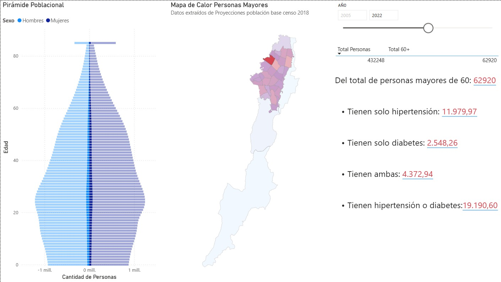
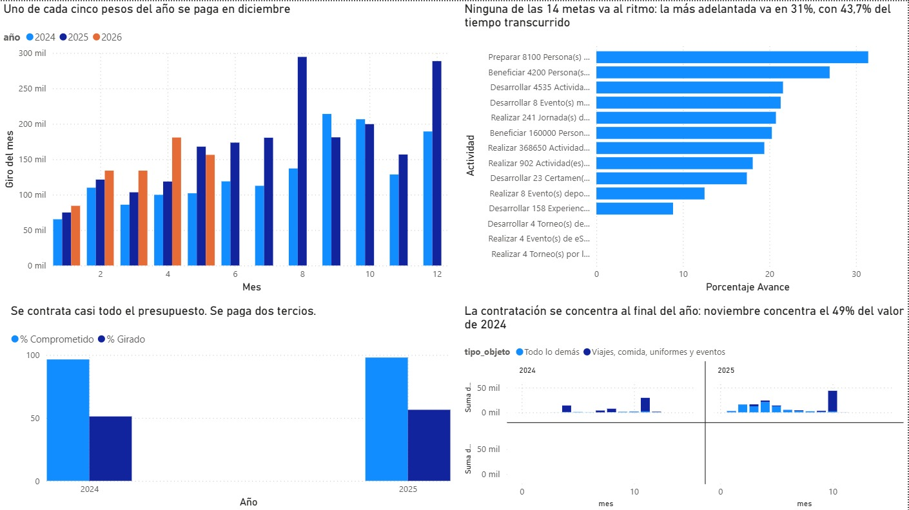
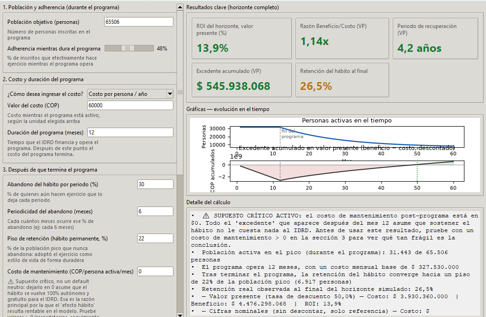

# Datajam-DED

# Contexto 

En el presente repositorio se encuentra el trabajo realizado para el concurso DATAJAM 2026 interuniversitario del equipo DED.
Los integrantes del grupo son: 
Diego Alejandro Arevalo Arias 
Esteban Garcia Gaitan
David Santiago Sanchez Torres 

# Archivos Estructura e instrucciones de  funcionamiento

## Estructura del repositorio

```
Datajam-DED/
├── README.md               Este archivo
├── requirements.txt        Dependencias de Python
├── .gitignore
│
├── data/                   Datos. Nada de código acá.
│   ├── raw/                Fuentes originales, tal como se descargaron
│   │   ├── datos_por_localidad.xlsx
│   │   ├── EncuestaMultiproposito2021ActividadFisica.csv
│   │   ├── mapas/          Geometría de localidad (shapeMap de Power BI)
│   │   └── sisben/         Volcados crudos del scrapper (no se versionan)
│   └── processed/          Todo lo que produce el código
│       ├── presupuesto/    Ejecución, contratación, desempeño, población
│       ├── poblacion_adulta/
│       ├── poblacion_mayor/
│       └── mapas/          Geometría de barrios con la llave de cruce
│
├── notebooks/              Código, en dos paquetes temáticos
│   ├── presupuesto/        Ejecución presupuestal y contratación
│   │   ├── download.py             Descarga las fuentes a data/raw/
│   │   ├── localidades.py          Normalización territorial (no se ejecuta solo)
│   │   ├── poblacion.py            Denominadores por localidad
│   │   ├── ejecucion.py            Ejecución mensual y anual
│   │   ├── contratos.py            Calendario y timing de contratos
│   │   ├── desempeno.py            Avance físico vs. financiero
│   │   ├── viz.py                  Figuras del análisis
│   │   ├── viz_ejecucion.py        Figuras de la página de ejecución
│   │   ├── calculadora.py          Calculadora de retornos de inversión
│   │   └── exportar_powerbi.py     Modelo en estrella para Power BI
│   └── poblacion/          Población por barrio, mapas y priorización
│       ├── mapa.py                                 Mapas de calor por barrio
│       ├── priorizacion.py                         Índice de prioridad
│       ├── poblacion_vs_presupuesto_localidad.py
│       ├── poblacion_vs_actividades_localidad.py
│       └── scrappers/
│           ├── adultos/            scrapper_sisben.py · normalizar_csv.py
│           └── adultos_mayores/    scrapper_sisben.py · normalizar_csv.py
│
├── outputs/                Resultados presentables
│   ├── figuras/            PNG + SVG de los análisis
│   ├── figuras_ejecucion/  Las seis figuras de la página de ejecución
│   ├── tablas/             Tablas de apoyo del informe
│   ├── powerbi/            Modelo en estrella listo para cargar
│       └── TodoPowerBI.zip Se encuentra .pbix y los datos necesarios
│   └── mapas/              Mapas de calor HTML
│       ├── poblacion_adulta/
│       └── poblacion_mayor/
│
└── docs/
    └── diccionario_datos.md    Qué significa cada columna de data/processed/
    └── Costos_diabetes_e_hipertensión_Bogotá_adultos_mayores.pdf    Análisis económico en la población mayor a 60 años
    └── Costos_diabetes_e_hipertensión_Bogotá_población_adulta.pdf    Análisis económico en la población adulta
```

Regla de oro sobre dónde escribe cada cosa:

| Carpeta | Qué va | Quién escribe ahí |
|---|---|---|
| `data/raw/` | Lo que se bajó de la fuente, sin tocar | `download.py`, los scrappers, descarga manual |
| `data/processed/` | Tablas derivadas, insumo de otros pasos | Los scripts de análisis |
| `outputs/` | Lo que se muestra: figuras, mapas, Power BI | Los scripts de visualización |

Ningún script usa rutas absolutas: todos resuelven la raíz del repositorio a
partir de `__file__`, así que el proyecto se puede clonar y ejecutar desde
cualquier equipo.

## Instrucciones de funcionamiento

Todo se ejecuta **desde la raíz del repositorio**. En Linux y macOS reemplazá
`py -3` por `python3`.

### 1. Instalación

```bash
git clone https://github.com/<usuario>/Datajam-DED.git
cd Datajam-DED

py -3 -m pip install -r requirements.txt

# Solo si vas a correr los scrappers del Sisbén:
py -3 -m playwright install chromium
```

### 2. Bloque de presupuesto — `notebooks/presupuesto/`

Es un paquete de Python: se ejecuta con `python -m`, **no** con
`python archivo.py` (los módulos se importan entre sí).

```bash
py -3 -m notebooks.presupuesto.download          # baja las fuentes a data/raw/
py -3 -m notebooks.presupuesto.poblacion         # denominadores por localidad
py -3 -m notebooks.presupuesto.ejecucion         # ejecución mensual y anual
py -3 -m notebooks.presupuesto.contratos         # calendario y timing de contratos
py -3 -m notebooks.presupuesto.desempeno         # avance físico vs. financiero
py -3 -m notebooks.presupuesto.viz               # -> outputs/figuras/
py -3 -m notebooks.presupuesto.viz_ejecucion     # -> outputs/figuras_ejecucion/
py -3 -m notebooks.presupuesto.exportar_powerbi  # -> outputs/powerbi/
```

`download.py` cachea: si el archivo ya está en `data/raw/` no lo vuelve a
bajar, salvo que le pases `--force`. Los CSV de Mapa de Inversiones son
grandes (Contratos puede pesar cientos de MB) y por eso están en `.gitignore`.

### 3. Bloque de población — `notebooks/poblacion/`

Scripts independientes, con menú interactivo (1 = adulta, 2 = mayor, 3 = ambas).

```bash
# a) Scrapping del visor del Sisbén — abre Chromium y tarda
py -3 notebooks/poblacion/scrappers/adultos/scrapper_sisben.py
py -3 notebooks/poblacion/scrappers/adultos_mayores/scrapper_sisben.py

# b) Normalización de nombres de barrio y construcción de la clave
py -3 notebooks/poblacion/scrappers/adultos/normalizar_csv.py
py -3 notebooks/poblacion/scrappers/adultos_mayores/normalizar_csv.py

# c) Análisis
py -3 notebooks/poblacion/poblacion_vs_presupuesto_localidad.py
py -3 notebooks/poblacion/poblacion_vs_actividades_localidad.py
py -3 notebooks/poblacion/priorizacion.py

# d) Mapas de calor -> outputs/mapas/
py -3 notebooks/poblacion/mapa.py
```

El paso (a) es imprescindible antes de (c) y (d): produce
`personas_Adultas_por_barrio_resumen.csv` y su equivalente de mayores. Esos CSV
todavía **no están versionados**, así que hay que generarlos primero.

`mapa.py` no descarga nada: lee la geometría de barrios ya versionada en
`data/processed/mapas/MapaPorBarriosBogota.json`.


# Librerias usadas forma de instalar

Todas están fijadas en [requirements.txt](requirements.txt). Se instalan de una
sola vez:

```bash
py -3 -m pip install -r requirements.txt
py -3 -m playwright install chromium     # solo para los scrappers
```

| Librería | Para qué se usa |
|---|---|
| `pandas` | Toda la manipulación de tablas |
| `numpy` | Operaciones vectoriales del índice de priorización |
| `scipy` | Correlación de Pearson en `poblacion_vs_presupuesto_localidad.py` |
| `openpyxl` | Leer los `.xlsx` (`datos_por_localidad`, proyecciones UPL) |
| `odfpy` | Leer el `.ods` de proyecciones de población de la SDP |
| `matplotlib` | Todas las figuras PNG y SVG |
| `geopandas` | Cargar y cruzar la geometría de barrios |
| `shapely`, `pyproj`, `fiona` | Dependencias geoespaciales de `geopandas` |
| `folium` | Mapas de calor interactivos en HTML |
| `branca` | Escalas de color de los mapas |
| `requests` | Descargas de `download.py` y de la geometría de barrios |
| `playwright` | Automatiza el visor del Sisbén en los scrappers |

`geopandas`, `fiona` y `pyproj` traen binarios de GDAL. Si la instalación falla
en Windows, la vía más corta es un entorno de conda:

```bash
conda install -c conda-forge geopandas folium
```

# Problema
Actualmente, las iniciativas públicas de promoción de actividad física para personas adultas (18-59) y mayores (60+) presentan cuatro fallas estructurales: (1) no está claro que su focalización territorial responda a criterios de necesidad real (prevalencia de enfermedad, sedentarismo, envejecimiento poblacional) en vez de inercia histórica o visibilidad política (2) los contratos que sostienen estos programas se adjudica sistemáticamente tarde en el año (octubre-noviembre), reduciendo el tiempo real de operación y probablemente el cumplimiento de metas, (3) no existe un modelo que cuantifique el retorno de inversión de estos programas en términos de ahorro en el sistema de salud, lo que dificulta justificar, dimensionar o priorizar su expansión y (4) no existe una política enfocada en la prevención de estas enfermedades por medio de la actividad física.  


# Pregunta

¿Cuál es el retorno económico y en salud de un programa distrital de actividad física focalizado en personas mayores de 60 años en Bogotá, y qué criterios territoriales y presupuestales maximizan su impacto dado el envejecimiento poblacional proyectado? 

# Metodologia


El trabajo siguió una secuencia de cuatro pasos encadenados. Primero, la delimitación del problema: se partió de una pregunta de política pública y a partir de ella se buscaron las fuentes, los proyectos de inversión del IDRD quedaron como unidad de análisis presupuestal. Segundo, la construcción de la base, integrando cuatro orígenes heterogéneos (Mapa de Inversiones, Datos Abiertos Bogotá, la oferta del IDRD por extracción manual y el visor del Sisbén mediante scrapping con Playwright) bajo una normalización territorial común que es lo que hace cruzables tablas que nunca fueron diseñadas para cruzarse. Tercero, el análisis en tres frentes paralelas: la calidad de la ejecución presupuestal, separando lo comprometido de lo girado y midiendo el mes de inicio de cada peso contratado y la concentración de giros en diciembre contra una referencia neutra; la demanda territorial, mediante un índice de prioridad por barrio que pondera sedentarismo, población, oferta per cápita y ejecución presupuestal per cápita y la valoración económica en salud, estimando la carga de hipertensión y diabetes con prevalencias de literatura revisada, valores de referencia de costo por paciente/año de la Cuenta de Alto Costo y una fracción atribuible a la inactividad física, tomando siempre el límite inferior de los intervalos de confianza para no sobreestimar el resultado. Cuarto, la modelación y la entrega: los tres frentes convergen en una calculadora de retorno que trata el programa como una intervención temporal con decaimiento de adherencia y piso de retención, con todos los flujos ajustados por inflación y traídos a valor presente, y en un visor de Power BI . Todo el proceso es reproducible de punta a punta de modo que cualquier persona pueda cambiar un parámetro y ver cómo se mueve la conclusión.


# Fuentes de Datos Usadas

Los datos vienen de cuatro orígenes:

- **[Mapa de Inversiones Bogotá](https://mapa-inversiones.gobiernoabiertobogota.gov.co/DatosAbiertos)** —
  presupuesto, proyectos de inversión y contratos del Distrito. Los perfiles de
  los dos proyectos de actividad física que se analizan son
  [8154 · Bogotá Deportiva](https://mapa-inversiones.gobiernoabiertobogota.gov.co/PerfilProyecto/8154)
  y [8155 · Programas recreativos y actividad física](https://mapa-inversiones.gobiernoabiertobogota.gov.co/PerfilProyecto/8155).
- **[Datos Abiertos Bogotá](https://datosabiertos.bogota.gov.co/)** — actividad
  física por localidad, proyecciones de población y geometrías oficiales.
- **[IDRD](https://www.idrd.gov.co/nuestros-programas)** — oferta de programas y
  programación de clases, por extracción manual.
- **[Visor Sisbén (SDP)](https://visorsisben.sdp.gov.co/)** — población por
  barrio, por scrapping.

Los archivos livianos están versionados en `data/`. Los pesados no: se regeneran
con `py -3 -m notebooks.presupuesto.download`.

# Principales Datos Granularidad y Fuente

CSV y EXCEL
| Nombre de la base de datos | Ubicación GitHub | Granularidad | Forma de obtener | Descripción y Uso |
|---|---|---|---|---|
| Datos Sisben | `data/processed/poblacion_adulta/`, `data/processed/poblacion_mayor/` (se genera) | Barrio | ScrapperSisben sobre el [visor](https://visorsisben.sdp.gov.co/) | Extraer los datos de personas adultas y mayores que habitan en determinado barrio. Insumo de `mapa.py`, `priorizacion.py` y los dos `poblacion_vs_*.py` |
| Encuesta Multipropósito - Actividad Física | [data/raw/EncuestaMultiproposito2021ActividadFisica.csv](data/raw/EncuestaMultiproposito2021ActividadFisica.csv) | Localidad | [Link](https://saludata.saludcapital.gov.co/osb/indicadores/proporcion-de-personas-que-realizan-actividad-fisica-en-bogota-d-c/) | Se encuentran índices de actividad física por localidad. `priorizacion.py` la usa como componente de sedentarismo |
| Proyecciones Poblacionales | No se versiona · `data/raw/sdp_poblacion_localidad.ods` | Localidad × edad × sexo | [Link](https://datosabiertos.bogota.gov.co/dataset/proyecciones-y-retroproyecciones-de-poblacion-2005-2035) · la baja `download.py` | Proyecciones poblacionales de Bogotá de 2005 a 2035. `poblacion.py` arma con ellas los denominadores (total, 15+, 45+, 60+) de todos los per cápita |
| Datos IDRD Localidad | [data/raw/datos_por_localidad.xlsx](data/raw/datos_por_localidad.xlsx) | Localidad | Extracción manual de [nuestros-programas](https://www.idrd.gov.co/nuestros-programas) y [escuelas deportivas adultos](https://www.idrd.gov.co/deportes/deporte-de-0-100/escuelas-deportivas-adultos) | Extracción manual de la oferta y presupuestos encontrados en la página del distrito. Cinco hojas: presupuesto por localidad, por categoría, ejecución, actividades por localidad y por escenario |
| Índice Priorización | `data/processed/poblacion_adulta/indice_prioridad_adulta.csv`, `data/processed/poblacion_mayor/indice_prioridad_mayor.csv` (se genera) | Barrio | CódigoPython — `priorizacion.py` | CSV creado cruzando los datos del Sisben, los datos del IDRD y la Encuesta Multipropósito para tener una lista de barrios a priorizar |
| Presupuesto General del Distrito | No se versiona · `data/raw/presupuesto_general.csv` | Entidad × mes | [Link](https://adlsinversionesbogota.blob.core.windows.net/opendata/DatosAbiertosPresupuestoGeneralDistrito.csv) · la baja `download.py` | Corte mensual de vigente, comprometido y girado. Es la fuente clave: `ejecucion.py` calcula con ella el % comprometido, el % girado y la concentración en diciembre |
| Proyectos de Inversión | No se versiona · `data/raw/proyectos_inversion.csv` | Proyecto × meta × actividad | [Link](https://adlsinversionesbogota.blob.core.windows.net/opendata/DatosAbiertosProyectosInversion.csv) · la baja `download.py` | Magnitudes programadas y entregadas. `desempeno.py` compara avance físico contra avance financiero |
| Contratos | No se versiona · `data/raw/contratos.csv` | Contrato | [Link](https://adlsinversionesbogota.blob.core.windows.net/opendata/DatosAbiertosContratos.csv) · la baja `download.py` | `contratos.py` busca menciones territoriales en el objeto contractual y mide en qué mes arranca cada peso contratado |
| Actividad Física - Enfermedades Crónicas (SDS) | Derivado versionado en [data/processed/presupuesto/riesgo_localidad.csv](data/processed/presupuesto/riesgo_localidad.csv) | Localidad | [Link](https://datosabiertos.bogota.gov.co/dataset/16025ea1-81cc-4947-b684-7a65303bb76b/resource/f5612407-9407-446c-b504-7ed1d21084ef/download/osb_enfermedadescronicas-actividadfisica.csv) · la baja `download.py` | Inactividad física 2017 vs. 2021 por localidad. Base del índice de riesgo que grafica `viz.py` |
| Oferta Escuelas Deportivas Adultos | Derivado versionado en [data/processed/presupuesto/oferta_escuelas_adultos.csv](data/processed/presupuesto/oferta_escuelas_adultos.csv) | Localidad | Extracción manual de la [programación publicada](https://www.idrd.gov.co/deportes/deporte-de-0-100/escuelas-deportivas-adultos) | Sesiones, escenarios y disciplinas por localidad. Es el único de los 14 programas del catálogo con horarios verificables |

MAPAS

| Nombre Mapa | Ubicación GitHub | Forma de Obtener | Descripción y Uso |
|---|---|---|---|
| Mapa Por Barrios Bogotá | [data/processed/mapas/MapaPorBarriosBogota.json](data/processed/mapas/MapaPorBarriosBogota.json) | [Link](https://datosabiertos.bogota.gov.co/dataset/sector-catastral) | Sector catastral enriquecido con `clave`, `barrio_norm` y `localidad_norm`. Es la geometría que `mapa.py` cruza con la población del Sisbén |
| Mapa Por Localidad Bogotá | [data/raw/mapas/MapaPorLocalidadBogota.json](data/raw/mapas/MapaPorLocalidadBogota.json) | [Link](https://datosabiertos.bogota.gov.co/dataset/localidad-bogota-d-c) | Límites por localidad, para el shapeMap del informe de Power BI |
| Mapa Por UPL Bogotá |[data/raw/mapas/MapaPorUPLBogota.json](data/raw/mapas/MapaPorUPLBogota.json) | [Link](https://datosabiertos.bogota.gov.co/dataset/upl_mv_intermedia_precisada) | Límites por UPL, usado para cruzar con las Proyecciones Poblacionales y construir el shapeMap por UPL |

SALUD

| Estudio/Entidad | Ubicación GitHub | Forma de Obtener | Descripción y Uso |
|---|---|---|---|
| National Institutes of Health | `docs/Costos_diabetes_e_hipertensión_Bogotá_adultos_mayores.pdf` | [Link](https://pubmed.ncbi.nlm.nih.gov/25804902/) | Se usa para conocer la prevalencia de hipertensión en adultos mayores de 60 años en Bogotá |
| Cuenta de Alto Costo (CAC) | `docs/Costos_diabetes_e_hipertensión_Bogotá_población_adultos.pdf` | [Link](https://cuentadealtocosto.org/wp-content/uploads/2025/07/Valores-de-referencia-para-enfermedades-en-seguimiento-por-CAC.pdf) | Se usa para conocer la comorbilidad de hipertensión y diabetes, así como los costos de cada una por paciente/año |
| Estudio Independiente | `README.md` | [Link](https://www.scielo.br/j/csc/a/SDKjttF3KFdwDDNw57sqWGk/?lang=en&ilang=en) | Estudio hecho en Brasil, se usa para conocer los costos aproximados de políticas públicas relacionadas al aumento de actividad física, y el abandono de sus participantes |

La mayor parte de estudios usados se dejan en la sección fuentes de los análisis económicos encontrados en la sección /docs del github.
# Hallazgos

# Contratacion

Dos patrones que se repiten todos los años y se refuerzan entre sí: **se
contrata tarde** y **sobra plata sin girar**.

## Se contrata tarde

Alcance: los dos proyectos de actividad física del IDRD (8154 y 8155), por mes
de inicio del contrato.

| Año | Valor que arranca en Q1 | Valor que arranca en Q4 | Mes pico | Concentra |
|---|---|---|---|---|
| 2024 | 0,2 % | 54,3 % | Noviembre | 49,0 % del año |
| 2025 | 26,6 % | 33,4 % | Octubre | 33,2 % del año |

En 2024, la mitad del dinero contratado empezó a ejecutarse en noviembre o
después, y **apenas 2 de cada 1.000 pesos arrancaron en el primer trimestre**.
Un programa de actividad física que empieza en noviembre no alcanza a producir
el efecto poblacional que promete su meta anual: la plata se gasta, el servicio
no se presta.

No es un problema de un solo año ni exclusivo de actividad física, pero sí se
agrava ahí. Comparando el mismo indicador contra dos líneas de referencia:

| % del valor que arranca en Q4 | 2024 | 2025 |
|---|---|---|
| Proyectos de actividad física | **54,3 %** | 33,4 % |
| IDRD completo | 37,6 % | 35,7 % |
| Todo el Distrito | 31,3 % | 15,8 % |

El Distrito en conjunto mejoró fuerte de 2024 a 2025 (31,3 % → 15,8 %); el IDRD
se quedó donde estaba.

## Y sobra plata

Alcance: IDRD completo, cierre de cada año.

| Año | Vigente | Comprometido | Girado | Sin girar |
|---|---|---|---|---|
| 2024 | $396.683 mm | 96,5 % | 64,6 % | **$140.544 mm** |
| 2025 | $546.189 mm | 91,6 % | 63,5 % | **$199.402 mm** |

Se logra **contratar** casi todo, pero solo sale por caja unos dos tercios. De
cada peso comprometido se pagó el 66,9 % en 2024 y el 69,3 % en 2025. En dos
años quedaron sin girar unos **$340.000 millones**.

Y lo que se gira, se gira tarde. Si el gasto se repartiera parejo, cada mes
pesaría 8,3 % del año y cada trimestre 25 %:

| IDRD | 2024 | 2025 | Referencia neutra |
|---|---|---|---|
| Giros de diciembre | 24,3 % | 20,3 % | 8,3 % |
| Giros del último trimestre | 48,2 % | 49,4 % | 25 % |

Diciembre pesa casi el triple de lo que le tocaría, y la mitad del año se ejecuta
en los últimos tres meses.

En los Fondos de Desarrollo Local la brecha es todavía mayor: comprometen el
96,4 % (2024) y el 98,8 % (2025), pero giran el 50,3 % y el 56,1 %. Eso sí, sin
el pico de diciembre del IDRD (9,8 % y 12,4 %, cerca de lo neutro).

## Por qué importan juntos

Los dos hechos son el mismo problema visto en dos momentos. Si el contrato se
firma en noviembre, el giro no alcanza a ocurrir dentro del año: aparece como
compromiso ejecutado en el papel y como caja sin salir en la práctica. El
indicador que la entidad reporta —96 % comprometido— se ve bien; el servicio
que la gente recibe corresponde al 64 % girado, y llega tarde.

> Nota de lectura: 2026 va con corte a mayo, así que sus porcentajes no son
> comparables con los años cerrados y no se incluyen arriba.

# Salud

### Población Adulta General — Bogotá

El costo actual del sistema de salud para atender hipertensión y diabetes en Bogotá asciende a **$5.521.170.800.065 COP anuales**. De este total, **$1.112.206.292.895 COP** son atribuibles directamente a la inactividad física.

#### Costo por segmento (COP/año)

| Segmento | Personas | Costo por persona/año | Costo total/año |
|---|---|---|---|
| Solo hipertensión (HTA) | 1.188.649 | $2.535.852 | $3.014.237.943.948 |
| Solo diabetes (DM) | 252.499 | $3.251.406 | $820.976.763.594 |
| Comórbido (HTA + DM) | 434.011 | $3.884.593 | $1.685.956.092.523 |
| **Total** | **1.875.159** | | **$5.521.170.800.065** |

#### Ahorro potencial sobre casos actuales 

| Escenario | Reducción sedentarismo | Ahorro anual (COP) |
|---|---|---|
| Realista | 8,5% | $94.536.326.522 |
| Optimista moderado | 19% | $211.318.617.810 |
| Muy optimista | 40% | $444.879.948.980 |

#### Ahorro acumulado sobre casos nuevos a 5 años (COP)

| Año | Realista | Optimista moderado | Muy optimista |
|---|---|---|---|
| 1 | $2.640.912.075 | $5.903.215.227 | $12.427.821.529 |
| 2 | $7.922.736.225 | $17.709.645.680 | $37.283.464.588 |
| 3 | $15.845.472.450 | $35.419.291.359 | $74.566.929.177 |
| 4 | $26.409.120.750 | $59.032.152.265 | $124.278.215.295 |
| 5 | $39.613.681.125 | $88.548.228.398 | $186.417.322.942 |

---

### Población Adulta Mayor (60+) — Bogotá

La carga actual del sistema de salud para atender hipertensión y diabetes en Bogotá a mayores de 60 años asciende a **$2.175.962.093.122 COP anuales**, de los cuales son atribuible a la inactividad física  **$438.724.570.657 COP anuales**, correspondiente a 139.476 casos de HTA y DM directamente relacionados con el sedentarismo.

#### Costo por segmento (COP/año)

| Segmento | Personas | Costo por persona/año | Costo total/año |
|---|---|---|---|
| Solo hipertensión (HTA) | 526.591 | $2.535.852 | $1.335.356.840.532 |
| Solo diabetes (DM) | 28.818 | $3.251.406 | $93.699.018.108 |
| Comórbido (HTA + DM) | 192.274 | $3.884.593 | $746.906.234.482 |
| **Total** | **747.683** | | **$2.175.962.093.122** |

#### Ahorro potencial sobre casos actuales — 60+

| Escenario | Reducción sedentarismo | Ahorro anual (COP) |
|---|---|---|
| Realista | 8,5% | $37.290.377.279 |
| Optimista moderado | 19% | $83.356.559.548 |
| Muy optimista | 40% | $175.492.175.492 |

#### Ahorro acumulado sobre casos nuevos a 5 años — 60+ (COP)

| Año | Realista | Optimista moderado | Muy optimista |
|---|---|---|---|
| 1 | $534.613.128 | $1.195.017.579 | $2.515.826.483 |
| 2 | $1.603.839.383 | $3.585.052.738 | $7.547.479.448 |
| 3 | $3.207.678.765 | $7.170.105.475 | $15.094.958.896 |
| 4 | $5.346.131.276 | $11.950.175.792 | $25.158.264.826 |
| 5 | $8.019.196.913 | $17.925.263.689 | $37.737.397.239 |

#### Prevención de complicaciones cardiovasculares (IAM y ACV) — 60+

| Escenario | IAM evitados/año | ACV evitados/año | Ahorro anual (COP) |
|---|---|---|---|
| Realista | 59 | 38 | $2.158.076.902 |
| Optimista moderado | 133 | 85 | $4.823.936.605 |
| Muy optimista | 279 | 179 | $10.155.656.010 |

#### Ahorro acumulado complicaciones a 5 años (COP)

| Año | Realista | Optimista moderado | Muy optimista |
|---|---|---|---|
| 1 | $2.158.076.902 | $4.823.936.605 | $10.155.656.010 |
| 2 | $4.316.153.804 | $9.647.873.210 | $20.311.312.021 |
| 3 | $6.474.230.707 | $14.471.809.815 | $30.466.968.031 |
| 4 | $8.632.307.609 | $19.295.746.420 | $40.622.624.042 |
| 5 | $10.790.384.511 | $24.119.683.025 | $50.778.280.052 |

---

### Análisis de Retorno — Escenario Realista, Población Mayor Bogotá

Este análisis estima el retorno esperado de un programa de actividad física focalizado en la población mayor sedentaria de Bogotá bajo el escenario más conservador.

| Parámetro | Valor |
|---|---|
| Población 60+ sedentaria Bogotá | 770.664 personas |
| Reducción de exposición (realista) | 8,5% |
| **Población objetivo** | **65.506 personas** |
| Costo por persona/año* | $600.000 COP |
| **Beneficio por persona** | **$41.106 COP/persona** |

> *Costo por persona ajustado por inflación a partir del estudio independiente disponible en la sección Fuentes del README.

Es importante mencionar que el análisis fue muy conservador, se tomaron de los intervalos de confianza los rangos inferiores (prevalencia de hipertensión y diabetes) y debido a falta de datos enfocados en la población mayor a 60, se tomaron los datos que se usan para la población adulta (esto causa una infravaloración del retorno económico, ya que la inactividad física y el costo por enfermedad, es mayor en adultos mayores). 
# Poblacion y Barrios

Luego de realizar un cruce entre los tres bases de datos principales, (Datos Sisben, Encuesta Multipropósito - Actividad Física, Datos IDRD Localidad) suponiendo que las proporciones de actividad fisica por localidad se distribuyen uniformemente en los barrios se encuentran los 4 a priorizar junto con los costos aproximados y ROI esperados calculados usando la calculadora de ROI. 

## Priorización de Barrios — Programa Personas Mayores

| Barrio | Localidad | Población | Costo Proyecto | ROI Esperado |
|---|---|---|---|---|
| Tintalá | Kennedy | 5,143 | $308,580,000 | 63.16% |
| Tibabuyes | Suba | 4,909 | $294,540,000 | 63.16% |
| La Aurora | Usme | 2,500 | $150,000,000 | 63.16% |
| Centro Usme Urbano | Usme | 2,341 | $140,460,000 | 63.16% |

## Priorización de Barrios — Programa Adultos

| Barrio | Localidad | Población | Costo Proyecto | ROI Esperado |
|---|---|---|---|---|
| Tintalá | Kennedy | 16,691 | $1,001,460,000 | 63.16% |
| Campo Verde | Bosa | 15,092 | $905,520,000 | 63.16% |
| Osorio III | Kennedy | 10,774 | $646,440,000 | 63.16% |
| Galán | Kennedy | 10,670 | $640,200,000 | 63.16% |

# Power BI
Se desarrolló un visor en power BI para población adulta y población mayor, se tienen las siguientes páginas que se pueden intercambiar clickeando un botón, con su respectiva función (Las dos primeras páginas tienen versiones de acuerdo a si es población adulta o población adulto mayor.): 


Mapa de calor con las personas por barrio, mapa con índices de actividad física por localidad, listado de localidades con mayores personas y barrios con mayor número de personas. 






Mapa de calor por barrios a priorizar teniendo en cuenta cruce de personas por barrios, índices de actividad física, presupuesto y oferta por localidad de deportes, se añade un lista de 20 barrios a priorizar, junto con cálculos de proyectos generados usando la calculadora de ROI que se encuentra en el github







Pirámide poblacional de acuerdo al año, mapa de calor por UPL para población mayor, estimados de personas con diabetes, hipertensión y comorbilidad (hipertensión y diabetes). 







Visualizador general de contratos, oferta y metas del IDRD en Bogotá, cuando se gira el dinero, cuando se contrata y estado actual de las metas.




# Calculadora de Inversión

La calculadora modela el programa de actividad física como una intervención temporal en dos fases: mientras se financia (Fase 1), una fracción de la población objetivo (adherencia) hace ejercicio de forma supervisada durante un número fijo de meses, al terminar (Fase 2), el costo operativo cesa (o baja a un costo de mantenimiento opcional) y la población activa decae con el tiempo mediante una función exponencial por periodos, hasta estabilizarse en un piso de retención que representa a quienes adoptaron el ejercicio como hábito permanente. El beneficio en salud se contabiliza cada mes en proporción a cuánta gente sigue activa, sin importar si el programa la sigue pagando, lo que permite evaluar si el "efecto multiplicador" del hábito hace rentable una intervención que, vista solo en su primer año, no lo sería.

Todos los flujos de costo y beneficio se ajustan por inflación año a año y luego se traen a valor presente con una tasa de descuento, de modo que las métricas de decisión (ROI, razón beneficio/costo y periodo de recuperación) reflejan pesos de hoy y no cifras nominales infladas artificialmente por horizontes largos. La herramienta expone además un supuesto crítico de forma explícita: si el costo de mantenimiento tras el programa se deja en $0, el modelo asume que sostener el hábito no le cuesta nada a la entidad, que es la principal razón por la que el "efecto hábito" resulta rentable, por eso la interfaz recomienda probar valores mayores a cero antes de usar el resultado como argumento de política pública.



Al experimentar con la calculadora identificamos que la rentabilidad del programa no depende de mantenerlo activo indefinidamente, sino de dos decisiones de diseño: priorizar a las poblaciones con mayor probabilidad de beneficiarse del ejercicio, y limitar el programa a una duración determinada enfocada en instalar el hábito, en lugar de sostener el subsidio de forma permanente. Bajo este enfoque, aunque una parte de los participantes abandone el ejercicio una vez termina la financiación, el piso de retención logra que suficiente población conserve el hábito por su cuenta, generando beneficios en salud que continúan acumulándose sin que el IDRD siga pagando por ellos. Esto convierte al programa en una inversión rentable no porque mantenga a todos activos para siempre, sino porque, incluso con deserción, el hábito que perdura es suficiente para que el beneficio de largo plazo supere ampliamente el costo concentrado en el tiempo en que el programa realmente operó.


# Conclusiones y Recomendaciones

**Conclusiones:**

La magnitud de la carga económica atribuible al sedentarismo en Bogotá es una señal de alerta que el sistema de salud no puede ignorar, más de $438.000 millones anuales en costos de hipertensión y diabetes en mayores de 60 años, más de 6.000 hospitalizaciones anuales por infarto y ACV en ese grupo etario, y una tendencia que se agravará con el envejecimiento poblacional proyectado para la próxima década. Actuar hoy es exponencialmente más barato que tratar las consecuencias mañana, cada infarto evitado representa $23 millones que el sistema no tiene que pagar.

El análisis de datos demuestra que no todos los barrios ni todas las localidades tienen la misma necesidad ni el mismo potencial de impacto. La combinación de alta concentración de población mayor, elevado sedentarismo y baja cobertura actual del programa identifica zonas específicas (como Tintala en Kennedy, Campo Verde en Bosa y Osorio III en Kennedy) donde la misma inversión genera un retorno en salud significativamente mayor que en zonas ya bien cubiertas. Sin un análisis territorial como este, el presupuesto se distribuye por inercia histórica y no por necesidad real.

La contratación de estos programas se concentra en el último trimestre del año, una práctica que comparte toda la administración distrital. Importa porque la actividad física solo produce beneficios en salud cuando es sostenida: un programa que arranca en noviembre entrega un ciclo corto, partido entre dos vigencias, y difícilmente alcanza a generar el hábito del que depende su propio efecto. Lo que se contrata tarde se ejecuta tarde, y lo que se ejecuta a medias no se convierte en salud.

Finalmente, este ejercicio no habría sido posible sin datos abiertos. La disponibilidad de registros RIPS, proyecciones poblacionales del DANE y datos de actividad física de la Encuesta Multipropósito permitió construir un modelo económico robusto y verificable. Al mismo tiempo, las brechas encontradas muestran que aún hay un camino importante por recorrer para que los datos abiertos sean verdaderamente útiles para el análisis de política pública.

---

**Recomendaciones:**

Anticipar los procesos de contratación al primer trimestre del año, garantizando al menos nueve meses continuos de operación por vigencia. Esta es la recomendación de menor costo y mayor impacto inmediato: no requiere presupuesto adicional, solo voluntad de gestión. Un programa que opera nueve meses genera tres veces más beneficio acumulado que uno que opera tres.

Adoptar la calculadora de retorno desarrollada en este proyecto como herramienta estándar para la planificación del programa. La calculadora permite estimar, para cualquier combinación de cobertura y costo por persona, el ahorro esperado en costos de hospitalización y prevencion de casos nuevos, ofreciendo a alcaldías locales, IDRD y EPS un lenguaje común para negociar la expansión y el co-financiamiento del programa.

Focalizar la expansión en los barrios identificados por el priorizador territorial: Tintala en Kennedy, Campo Verde en Bosa y Osorio III en Kennedy concentran simultáneamente alta proporción de mayores de 60 años, altos niveles de sedentarismo y baja cobertura actual. Intervenir ahí primero maximiza el impacto por peso invertido.

Explorar un mecanismo formal de co-financiación entre el IDRD y las EPS con mayor presencia en las localidades priorizadas. 

Publicar en el Portal de Datos Abiertos de Bogotá los datos operativos del programa de actividad física, condición de los contratos y estadisticas de prevalencia y costos de enfermedades. Estos datos son los que más falta hacen para perfeccionar el modelo y para que ejercicios como este puedan hacerse con mayor precisión en el futuro.
